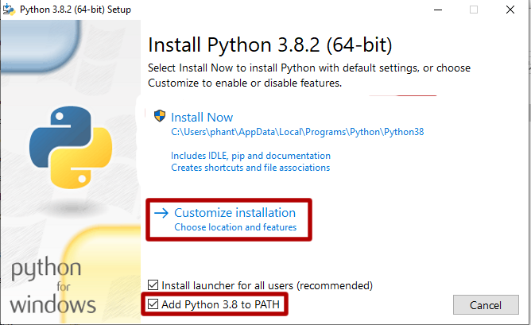
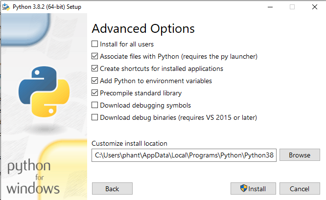

# Install Python

Python is available for several operating systems and architecture combinations. These guides are focused on `Python 3` only.

## Windows

The easiest way to install `Python 3` on `Windows` is to use the official `Python 3 Installer`.

You can download the installer file (`.exe`) by opening the following link on a `Windows` PC.

https://www.python.org/ftp/python/3.8.2/python-3.8.2-amd64.exe

When running the installer make sure to check the box that says `Add Python 3.6 to PATH`.



After that you should choose `Customize Installation`. Make sure your custom installation settings are the same as the following images.





Once `Python 3` has finished installing you will be able to run `Python 3` scripts by opening a `Command prompt` and typing the name of the file.

Assuming we have a simple `Python 3` file on our desktop named `myscript.py`:

```
cd c:\Users\(username)\Desktop
python myscript.py
```

You can also double click `.py` files and they will automatically start a `Python` interpreter and begin executing the code until it finishes.

## OSX / macOS

The easiest way to install `Python 3` on `OSX` and `macOS` is to use the package manager `Homebrew`.


Open a terminal window and enter the following commands:

```
brew update
brew install python3
```

If you don't have `Homebrew` installed you can install it by entering the following command in a terminal:

```
/usr/bin/ruby -e "$(curl -fsSL https://raw.githubusercontent.com/Homebrew/install/master/install)"
```

Once `Python 3` has installed, you can verify it is correctly linked to your `PATH` by using the following command:

```
python3 --version
```


# Linux (Ubuntu)

The easiest way to install `Python 3` on `Ubuntu` is by using the built in package manager.

Open a terminal window and enter the following commands:

```
sudo apt-get update
sudo apt-install python3
sudo apt-get install python3-pip
```

Once `Python 3` has installed, you can verify it is correctly linked to your `PATH` by using the following command:

```
python3 --version
```
